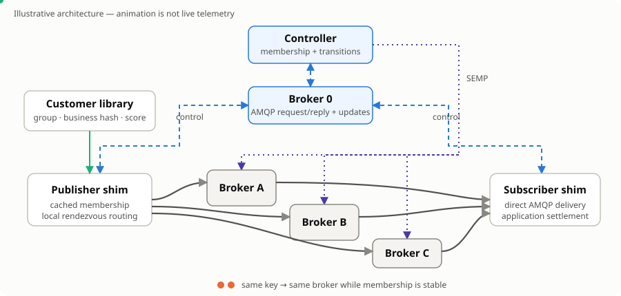

# Solace Workload Balancer

This project is a Go layer for keeping related application messages on one Solace PubSub+ broker while spreading independent work across several brokers.

> **Current status:** the basic three-broker AMQP 1.0 data path works, but recovery and live membership changes are not qualified. This repository is not production-ready.



## How it works

The system has four application parts:

1. **Controller** — owns membership and transition state, monitors and configures data-broker resources through SEMP, and publishes control decisions.
2. **Publisher shim** — durably accepts application messages, caches membership, chooses a broker locally, and sends business traffic directly to it over AMQP 1.0.
3. **Subscriber shim** — consumes directly from durable queues on the data brokers and passes deliveries to the application for settlement.
4. **Customer library** — receives a read-only view of the whole message and owns the scaling group, business hash, and rendezvous score contract.

A separate logical service, **Broker 0**, carries control traffic. Shims discover authoritative membership with correlated AMQP request/reply and then receive updates through Broker 0. They do not ask the controller where to send each message.

For every message, the publisher shim scores the current brokers from its cached membership. The highest rendezvous score wins. The same business key therefore selects the same broker while membership and the customer routing contract remain stable. Business payloads travel directly between the shims and data brokers; they do not pass through the controller or Broker 0.

For example, `order-42` created and updated messages stay on Broker B, while `order-99` can route to Broker A. Hashing alone does not sequence concurrent producers.

## Customer routing contract

Application code implements the current Go interfaces in [`customer/customer.go`](customer/customer.go):

```go
type CustomerLibrary interface {
    GetScalingGroup(MessageView) (string, error)
    GetBusinessHash(MessageView) (BusinessHash, error)
}

type RoutingHashPolicy interface {
    GetRendezvousScore(ScoreInput) (RoutingScore, error)
    RoutingAlgorithm() string
}
```

`MessageView` exposes the topic, headers, payload, and event ID as a borrowed read-only view. The customer implementation defines what constitutes a group and business key, and how candidates are scored. The router only compares scores and selects the winner.

## Ordering and handover boundaries

A publisher processes one local lane head at a time for each `scaling group + business hash`. Independent keys can proceed concurrently, but one hot key remains on one broker and one local lane.

Membership handover follows `PREPARE → PAUSE → FENCE → DRAIN → COMMIT → ACTIVATE`. The intent is to prepare target queues, stop new source traffic, verify drain through SEMP, commit the new membership, and resume publishers. That transition exists in code but has not been qualified under continuous live traffic and failures.

Ordering is not global. It is not guaranteed across multiple publisher processes, restarts, failover, or concurrent producers. Uncertain publishes and redelivery can create duplicates, so applications that need stronger processing guarantees require stable event IDs and durable idempotency or deduplication.

## Current application interface

The runnable `cmd/publisher` and `cmd/subscriber` programs use strict newline-delimited JSON on standard input and output. The existing Go packages can be embedded directly, as the command programs demonstrate, but the CLI is **not** a drop-in AMQP or Solace SDK interface.

Publisher input is one object per line:

```json
{"event_id":"event-1","topic":"synthetic/events","headers":{"scaling-group":"events-a","entity_id":"entity-001"},"payload_base64":"e30="}
```

A publisher receipt means the record was accepted into the local durable outbox; it does not mean the broker acknowledged it. The subscriber writes deliveries as NDJSON and waits for a matching `ack`, `retry`, `reject`, or `release` response. See `-help` on each command for the exact fields.

## Build and run

Requirements:

- Go 1.26.4;
- existing Broker 0 and data-broker services/message VPNs with AMQPS connectivity;
- SEMP access for the controller;
- pre-provisioned Broker 0 participant-scoped durable request/reply, membership-update, command, registration, acknowledgement, readiness, and telemetry resources with their topic subscriptions and ACLs;
- credentials exported under the environment-variable names selected in the configuration.

The controller uses SEMP to create or verify its deterministic data-plane epoch queues and subscriptions. It does not provision broker services, message VPNs, Broker 0 control resources, or production identities and ACLs.

Copy and adapt [`config.example.yaml`](config.example.yaml). Its endpoints are placeholders. Its credential fields name environment variables rather than containing secrets. The controller needs Broker 0 messaging and SEMP credentials plus data-broker SEMP credentials; each participant needs its own Broker 0 messaging credentials plus data-broker messaging credentials.

```bash
make validate
make build

./bin/controller -config config.example.yaml
./bin/subscriber -config config.example.yaml -participant events-a-subscriber-1
./bin/publisher -config config.example.yaml -participant events-a-publisher-1
```

Run those processes in separate terminals after provisioning and exporting credentials. Start the controller first, then the subscriber and publisher. Keep the subscriber input open so the application can return settlement records, and write publisher NDJSON records to the publisher's standard input.

## Current limitations

Local validation found important unresolved defects:

- publisher and subscriber AMQP objects do not rebuild after a broker restart;
- an immediate send error can be retried even when transmission may be uncertain;
- a failed native settlement cannot currently be retried safely;
- a slow delivery can block unrelated keys sharing the same queue;
- the documented multi-participant/competing-subscriber shape is incomplete;
- an unresolved uncertain acknowledgement can stall a transition past its deadline;
- membership transitions under continuous live traffic are not qualified;
- controller state is single-instance local state with no HA or consensus.

There is no claim of exactly-once delivery, uninterrupted failover, global ordering, automatic recovery, 100,000 messages/second, or production readiness.

## Optional SDKPerf test path

SDKPerf is test tooling only. The current adapter accepts an outer JCSMP/SMF test path, forwards through the existing Go publisher and subscriber shims, and returns results to SDKPerf. It is not end-to-end AMQP SDKPerf traffic and is not part of the production application path.

## Repository map

- `cmd/` — controller, publisher, subscriber, and small examples
- `customer/`, `routing/` — customer contract and rendezvous selection
- `shim/`, `outbox/` — publisher/subscriber behavior and durable publisher state
- `broker0/`, `control/` — control messages, request/reply, naming, and reconciliation
- `controller/`, `runtime/`, `policy/` — authority, assembly, transitions, and policy
- `integration/`, `semp/`, `cloud/` — AMQP/SEMP adapters, tests, and guarded cloud lifecycle code
- `tools/` — dashboard and optional SDKPerf tooling

## Verification

```bash
make test
make test-python
make test-race
make vet
make build
make integration
```

These checks include broker-free integration tests. Real-broker and failure qualification require explicitly configured, isolated services; they are not implied by a passing local test suite.

## License

See [`LICENSE`](LICENSE).
